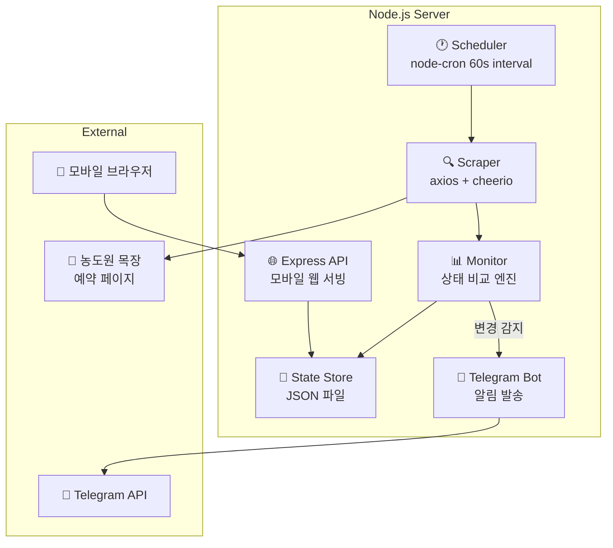

# 농도원 목장 예약 취소 모니터 - 구현 계획서

농도원 목장(nongdo.co.kr) 예약 페이지를 **24시간** 모니터링하여, 예약 마감 날짜에 취소 물량 발생 시 즉시 텔레그램으로 알림을 보내는 **프라이빗 모바일 웹 앱**. 외부에서도 접속 가능하도록 Cloudflare Tunnel로 퍼블리시.

## 사이트 분석 결과

| 항목 | 내용 |
|------|------|
| URL 패턴 | `menu4_sub1_1.php?conf=&date=YYYYMM01&bmain=list` |
| 렌더링 | Server-side PHP (AJAX 없음) |
| 캘린더 테이블 ID | `nongdo_schedule` |
| 예약마감 표시 | `` |
| 예약가능 표시 | `<a href="menu4_sub1_3.php?...">` 링크 존재 |
| 체험 가능 요일 | 주말 (토/일) - `cont7`(토), `cont1`(일) |
| 예약 오픈 | 매월 1일 09:00, 다다음 달 예약 오픈 |

---

## 기술 스택

| 영역 | 기술 | 목적 |
|------|------|------|
| 런타임 | Node.js | 백엔드 서버 |
| 웹 프레임워크 | Express.js | API 및 정적 파일 서빙 |
| HTML 파싱 | Cheerio | 예약 페이지 스크래핑 |
| HTTP 클라이언트 | axios | 페이지 요청 |
| 텔레그램 | node-telegram-bot-api | 알림 발송 |
| 스케줄링 | node-cron | 주기적 모니터링 |
| 프론트엔드 | HTML + Vanilla CSS + JS | 모바일 웹 UI |
| 환경변수 | dotenv | 설정 관리 |
| 외부 접속 | Cloudflare Tunnel | 로컬 서버 퍼블리시 |
| 프로세스 관리 | pm2 | 24/7 무중단 운영 |

---

## 아키텍처



---

## 파일 구조

```
d:/Codes/farmonitor/
├── .env.example          # 환경변수 템플릿
├── .gitignore
├── package.json
├── ecosystem.config.cjs  # PM2 24/7 설정
├── docs/
│   ├── Plan/
│   ├── Telegram_Bot_Setup_Guide.md
│   └── Cloudflare_Tunnel_Setup_Guide.md
├── src/
│   ├── index.js          # 앱 진입점
│   ├── server.js         # Express API
│   ├── scraper.js        # 예약 페이지 스크래핑
│   ├── monitor.js        # 상태 비교 & 변경 감지
│   └── telegram.js       # 텔레그램 알림
├── public/
│   ├── index.html        # 모바일 웹 UI
│   ├── style.css         # 다크 테마, 글래스모피즘
│   └── app.js            # 프론트엔드 로직
└── data/                 (gitignore, 런타임 생성)
    ├── state.json
    └── history.json
```

---

## 주요 모듈 설명

### Scraper (`src/scraper.js`)
- `fetchMonthlyCalendar(yearMonth)` - 월별 예약 페이지 HTML fetch
- `parseReservationStatus(html, yearMonth)` - cheerio로 캘린더 파싱
- 사용자가 UI에서 선택한 **임의의 월** 모니터링
- `icon_1.gif` → 마감 / `<a>` 링크 → **가능** / 없음 → 미운영

### Monitor (`src/monitor.js`)
- node-cron 기반 60초 간격 폴링
- **마감 → 가능** 전환 감지 시 텔레그램 알림 트리거
- 상태/이력 JSON 파일 저장

### Telegram (`src/telegram.js`)
- 취소 발생 알림 (날짜, 요일, 예약 링크 포함)
- 연결 테스트 기능

### API Server (`src/server.js`)
- `GET /api/status?month=YYYYMM` - 예약 상태 조회
- `GET /api/history` - 변경 이력
- `POST /api/check-now` - 즉시 체크
- `POST /api/settings` - 모니터링 설정 (대상 월, 간격)

### Frontend (모바일 웹)
- 다크 모드, 글래스모피즘, micro-animations
- **월 선택 캘린더 UI** (사용자가 모니터링 대상 월 직접 선택)
- 날짜별 예약 상태 시각화
